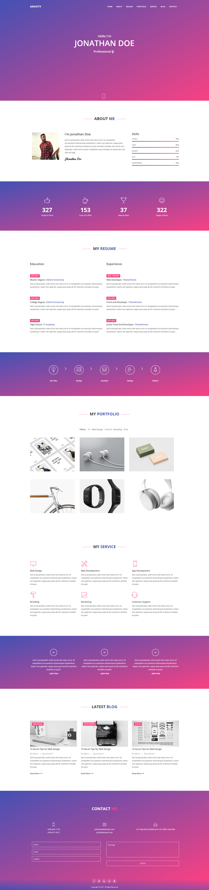
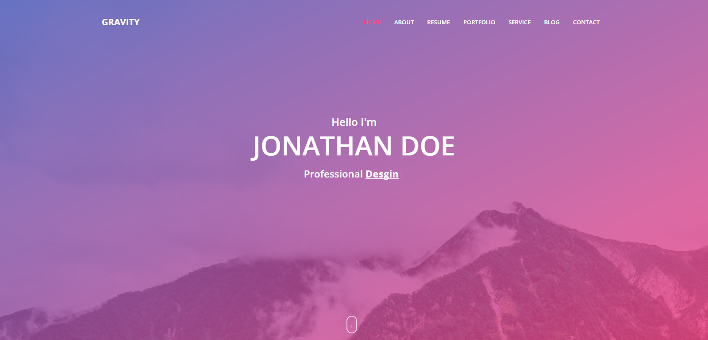

# Gravity Website
Gravity is a one page scrolling website built with HTML, CSS, Bootstrap and JQuery.

### Features
* One page scrolling with smooth scroll and scrolling navigation
* Jade & SASS files for easily changing features such as colors and fonts
* Modular design, sections can be remove or added whenever necessary
* Responsive - Looks good and both desktop and mobile devices
* Portfolio Category filter built completely in JQuery, no additional plugins were required
* Built with bootstrap so any modules from the bootstrap library can be used within the web page.

### Version One Full Page - Solid Background

### Version Two - With Background Image

